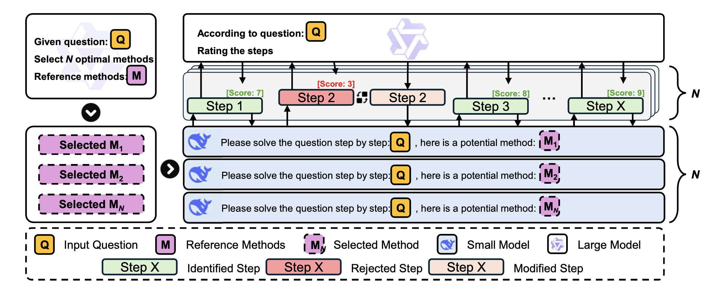

# SSR: Speculative Scale Reasoning

Large language models (LLMs) have achieved impressive results on multi-step mathematical reasoning, yet at the cost of high computational overhead. This challenge is particularly acute for test-time scaling methods such as parallel decoding, which increase answer diversity but scale poorly in efficiency. To address this efficiency-accuracy trade-off, we propose SSR (Speculative Parallel Scaling Reasoning), a training-free framework that leverages a key insight: by introducing speculative decoding at the step level, we can accelerate reasoning without sacrificing correctness. SSR integrates two components: a Selective Parallel Module (SPM) that identifies a small set of promising reasoning strategies via model-internal scoring, and Step-level Speculative Decoding (SSD), which enables efficient draft-target collaboration for fine-grained reasoning acceleration. Experiments on three mathematical benchmarks-AIME 2024, MATH-500, and LiveMathBench - demonstrate that SSR achieves strong gains over baselines. For instance, on LiveMathBench, SSR improves pass@1 accuracy by 13.84% while reducing computation to 80.5% of the baseline FLOPs. On MATH-500, SSR reduces compute to only 30% with no loss in accuracy.



## Project Structure

### reason

- **base_test.py**: Implementation for baseline testing, evaluating the fundamental performance of models on mathematical problems by directly using large language models to generate complete reasoning processes in one go.

### scale + reason

- **scale_reason.py**: Implements parallel reasoning experiments for base models, improving problem-solving efficiency and accuracy by running multiple reasoning tracks simultaneously (using different role prompts). (Use without --use_role_prompts for prompt-free parallel reasoning)

### spec + scale + reason

- **spec_scale_reason.py**: Implements the core experiment of Speculative Reasoning, which improves efficiency by using small models to generate reasoning steps and large models to score and correct them, combined with multi-role parallel reasoning.

- **spec_scale_reason_async.py**: Adds asynchronous parallel processing functionality based on speculative reasoning, theoretically further improving reasoning efficiency, but currently not fully debugged.

- **spec_scale_reason_2.py**: Adds a solution method path selection module based on speculative reasoning, improving problem-solving efficiency and accuracy by selecting appropriate solving strategies for different problems.

### Evaluation Modules

- **baseline_eval.py**: Used to evaluate the output results of base_test.py and scale_reason.py, calculating accuracy and other performance metrics.

- **spec_eval.py**: Used to evaluate the output results of speculative reasoning related experiments (spec_scale_reason.py, spec_scale_reason_async.py, and spec_scale_reason_2.py).

## Key Features

- **Multi-role Reasoning**: Guide models to think about problems from different perspectives through different role prompts (replaced with method prompts)
- **Speculative Reasoning**: Use small models to generate reasoning steps, large models to score and correct, improving efficiency
- **Method Path Selection**: Select appropriate solving strategies for different types of problems, guiding models to think from different angles through different method prompts
- **Asynchronous Parallel Processing**: Attempt to further improve reasoning efficiency through asynchronous methods (pending)

## Usage

### Setup & Installation
```bash
git clone https://github.com/YuanlinChu/SSR-Spec_Scale_Reasoning.git
cd SSR-Spec_Scale_Reasoning
pip install -r requirements.txt
```

### Baseline Testing

```bash
python base_test.py --dataset_name aime --problem_id 60-89 --repeat_id 3 --model_name Qwen/QwQ-32B --output_dir results/baseline_vllm_test
```

### Parallel Reasoning

```bash
python scale_reason.py --dataset_name aime --problem_id 60-89 --repeat_id 3 --model_name Qwen/QwQ-32B --output_dir results/scale_reason --use_role_prompts
```

### Speculative Reasoning

```bash
python spec_scale_reason.py --dataset_name aime --problem_id 60-89 --repeat_id 3 --output_dir results/spec_scale_Inf --score_threshold 7.0 --token_budget 8192 --score_method greedy
```

### Method Path Selection Reasoning

```bash
python spec_scale_reason_2.py --dataset_name aime --problem_id 60-89 --repeat_id 3 --output_dir results/spec_scale_m --score_threshold 7.0 --token_budget 8192 --score_method greedy --method_num 3
```

### Evaluate Results

```bash
python baseline_eval.py --dataset_name aime --model_name QwQ-32B --results_dir results/baseline_vllm_test
python spec_eval.py --dataset_name aime --model_name QwQ-32b --results_dir results/spec_scale_m
```

## Dataset Support

This project supports multiple mathematical reasoning datasets:
- AIME (American Invitational Mathematics Examination)
- MATH (Complex Mathematical Problem Set)
- GPQA (Multiple Choice Question Answering)
